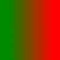

:docType: book
:docinfo1:
:lang: ru
:name: значение
:documentYear: 2015
:documentType: Статья
:productType: Скрипт
:productFullName: Конвертор docbook в docx
:productShortName: Конвертор

pass::[<toc/>]

== Заголовок1
=== Заголовок2
==== Заголовок3
===== Заголовок4
Абзац.
Разделить абзацев- пустая строка, а не конец строки.

Новый абзац. Подстановка переменной {name}.

 Параграф, начинающийся с пробела(ов) - не форматируется (что-то вроде цитаты, текста программы).
 
//Комментарий (не отображается)

++++
Передается в исходном виде, без подстановок {name}.
++++

____
Цитата
____

Текст программы (образец сообщений)..
-----
QApplication app(argc, argv);
app.exec();
-----

.Практически у любого элемента может быть заголовок (идет перед текстом и начинается с .)
Разрыв +
строки

Нормальный, _курсив_, *полужирный*, ^верхний^, ~нижний~ текст.

[[metka_teksta]]
Текст с меткой

Ссылка на метку <<metka_teksta>>

link:cheatsheet.adoc[Ссылка на сайт или файл]

[[metka-risunka]]
.Заголовок рисунка

Ссылка на рисунок <<metka-risunka>>

Вставка внешнего файла:
include::text.txt[]

.Списки
* С маркером
* С маркером
** С маркером
*** С маркером
* С маркером

//^ - разрыв списка

. Стандартные значки в зависимости от уровня
. Стандартные значки в зависимости от уровня
.. Стандартные значки в зависимости от уровня
... Стандартные значки в зависимости от уровня
. Стандартные значки в зависимости от уровня

Список также можно разбивать любым параграфом.

a. С текстом
a. С текстом
1. Нумерованный
1. Нумерованный
3. Нумерованный

.Таблицы
Образцы таблиц

.Обычная таблица, неудобно рисовать
[options="header"]
|=======================
|Col 1|Col 2      |Col 3
|1    |Item 1     |a
|2    |Item 2     |b
|3    |Item 3     |c
|6    |Three items|d
|=======================

.Таблица с данными, через запятую
[format="csv",options="header"]
|======
Заголовок,Заголовок,Заголовок,Заголовокы
1,2,3,4
a,b,c,d
A,B,C,D
|======

